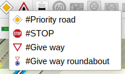

# ToolbarCategories-plugin for [JOSM](https://josm.openstreetmap.de)

A plugin for OpenStreetMap-Editor JOSM that can hold toolbar actions inside a popup menu to reduce space usage in toolbar.

The first element in a category can directly be accessed by clicking with the middle mouse button on the icon of the category. Should an element support modifiers (ctrl, shift, alt or meta) while clicking with the left mouse button those will also be supported by clicking with the middle mouse button. Multiple clicks on the icon are also supported if the element handles those differently.

Preferences:
 * `org.openstreetmap.josm.plugins.toolbarcategories.ToolbarCategoriesPlugin.middleMouseButtonForOtherToolbarActions`
    * possible values `true` (default) or `false`
    * if set to `true` other toolbar elements will also work with clicking with the middle mouse button on it